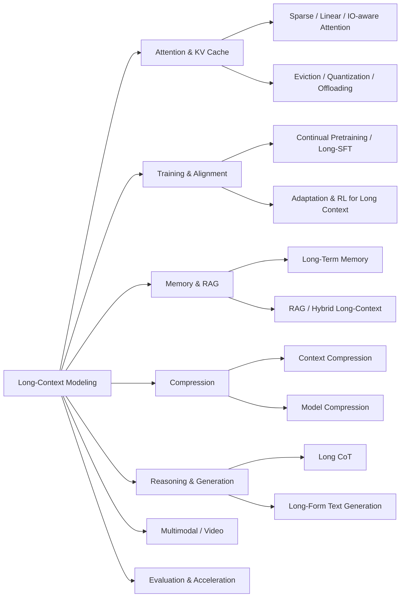

# Large Language Model Based Long Context Modeling Papers and Blogs

<!--
[](https://github.com/Xnhyacinth/Awesome-LLM-Long_Context_Modeling) [](https://opensource.org/licenses/MIT) -->
<div align="center">
 <p align="center">

<a href="https://arxiv.org/abs/2503.17407">📝 Survey Paper</a> |
<a href="#-papers">📄 Paper List</a> |
<a href="https://xnhyacinth.github.io/projects/Awesome-LCLM/">🏠 Homepage</a> |
<a href="https://www.notion.so/Huanxuan-Liao-s-Blog-6518cf95f0d54858829b042588ff88bb">📚 Notes</a> |
<a href="https://github.com/Xnhyacinth/Awesome-LLM-Long-Context-Modeling">⭐ GitHub</a>

 </p>
</div>
<div align="center">

[](https://awesome.re)
[](https://github.com/Xnhyacinth/Awesome-LLM-Long-Context-Modeling/blob/main/LICENSE)
[](https://github.com/Xnhyacinth/Awesome-LLM-Long-Context-Modeling/commits/main)
[](https://github.com/Xnhyacinth/Awesome-LLM-Long-Context-Modeling/stargazers)
[](https://github.com/Xnhyacinth/Awesome-LLM-Long-Context-Modeling/forks)
[](https://github.com/Xnhyacinth/Awesome-LLM-Long-Context-Modeling/graphs/contributors)
[](https://github.com/Xnhyacinth/Awesome-LLM-Long-Context-Modeling)
[](https://github.com/Xnhyacinth/Awesome-LLM-Long-Context-Modeling/pulls)
[](https://arxiv.org/abs/2503.17407)

</div>

This repository curates papers and blogs on long-context language modeling, covering surveys; efficient attention; KV-cache optimization; recurrent transformers and state-space models; position encoding & length extrapolation; long-context training; long-term memory; retrieval-augmented generation; in-context learning; context and model compression; long reasoning (long CoT); long video & image; long-horizon agents; long-text generation; inference acceleration; benchmarks & evaluation; and technical reports.

🔥 Must-read papers for LLM-based Long Context Modeling.

🔥⚡🔥 Thanks for all the great contributors on GitHub!

🚀🤝🚀 I have the privilege of joining [**LCLM-Horizon**] and collaborating with them on providing a very complete and comprehensive scholarly survey \([A Comprehensive Survey on Long Context Language Modeling](https://arxiv.org/abs/2503.17407)\) and repository \([A-Comprehensive-Survey-For-Long-Context-Language-Modeling](https://github.com/LCLM-Horizon/A-Comprehensive-Survey-For-Long-Context-Language-Modeling)\) dedicated to **Long Context Language Modeling**. I look forward to collaborating with them to advance research and deepen understanding in this area!

<!--Thanks to [**LCLM-Horizon**]\([A-Comprehensive-Survey-For-Long-Context-Language-Modeling](https://github.com/LCLM-Horizon/A-Comprehensive-Survey-For-Long-Context-Language-Modeling)\) for providing a very complete and comprehensive scholarly survey \([A Comprehensive Survey on Long Context Language Modeling]()\) of the field of Long Context Language Modeling. I have joined them and we will collaborate to further research and understanding in this area!-->

<details>
<summary><b>Taxonomy at a glance</b></summary>



</details>

If you find our repository and survey useful for your research, please consider citing the following paper:

```bibtex
@article{liu2025comprehensive,
  title={A Comprehensive Survey on Long Context Language Modeling},
  author={Liu, Jiaheng and Zhu, Dawei and Bai, Zhiqi and He, Yancheng and Liao, Huanxuan and Que, Haoran and Wang, Zekun and Zhang, Chenchen and Zhang, Ge and Zhang, Jiebin and others},
  journal={arXiv preprint arXiv:2503.17407},
  year={2025}
}
```

## Contents

- [📢 News](#-news)
  - [Week Papers](#week-papers)
  - [Month Papers](#month-papers)
- [📜 Papers](#-papers)
  - [1. Survey Papers](papers/01-survey.md)
  - [2. Efficient Attention](papers/02-efficient-attention.md)
  - [3. KV-Cache Optimization](papers/03-kv-cache.md)
  - [4. Recurrent Transformers](papers/04-recurrent-transformers.md)
  - [5. State Space Models & Hybrids](papers/05-state-space-models.md)
  - [6. Position Encoding & Length Extrapolation](papers/06-position-encoding.md)
  - [7. Long-Context Training](papers/07-long-context-training.md)
  - [8. Long-Term Memory](papers/08-long-term-memory.md)
  - [9. Retrieval-Augmented Generation](papers/09-retrieval-augmented-generation.md)
  - [10. In-Context Learning (Many-shot / Long-ICL)](papers/10-in-context-learning.md)
  - [11. Context Compression](papers/11-context-compression.md)
  - [12. Model Compression for Long Context](papers/12-model-compression.md)
  - [13. Long Reasoning (Long CoT)](papers/13-long-reasoning.md)
  - [14. Long Video & Image](papers/14-long-video-image.md)
  - [15. Long-Horizon Agents](papers/15-long-horizon-agents.md)
  - [16. Long-form Text Generation](papers/16-long-form-text-generation.md)
  - [17. Inference Acceleration & Serving](papers/17-inference-acceleration.md)
  - [18. Benchmarks & Evaluation](papers/18-benchmarks.md)
  - [19. Technical Reports (Long-Context Models)](papers/19-technical-reports.md)
  - [20. Blogs & Tutorials](papers/20-blogs.md)
- [Acknowledgements](#acknowledgements)
  - [Contributors](#contributors)
  - [Star History](#star-history)

## 📢 News

### Week Papers

- **[2026.08.14]**
  - Paper: [SimpleOPD: Simple Tokenizer-Agnostic On-Policy Distillation for Long-Context Reasoning](https://arxiv.org/abs/2608.14277)
  - Paper: [KV Cache Compression Through the Lens of Transform Coding](https://arxiv.org/abs/2608.14191)
  - Paper: [MemoryLake on MemoryArena: A Matched Study of Agent Memory Backends](https://arxiv.org/abs/2608.13883)
  - Paper: [AgentRewind: Recoverable Execution for Long-Horizon LLM Agents](https://arxiv.org/abs/2608.14380)
  - Paper: [ScienceFlow: A long-horizon agent for ML research, scientific discovery and beyond](https://arxiv.org/abs/2608.14354)
  - Paper: [MedClaw: Heuristic Agent Harness for Long-Horizon Surgical Video Reasoning](https://arxiv.org/abs/2608.14015) [](https://fyycs.github.io/medclaw/)
  - Paper: [Handover of In-Context Learning State Across Session Boundaries](https://arxiv.org/abs/2608.14528)

- **[2026.08.13]**
  - Paper: [The Query Knows What to Forget: A Second Erase Direction for Linear Attention](https://arxiv.org/abs/2608.13668)
  - Paper: [When Local Variance Optimality Is Not Enough: RoPE-Aligned Q/K Rotations for Dynamic 4-Bit Quantisation](https://arxiv.org/abs/2608.13365)
  - Paper: [RippleMem: From Isolated Retrieval to Associative Recollection for Long-Term Agent Memory](https://arxiv.org/abs/2608.13334)
  - Paper: [vToken: Token-Level Virtualization for Reclaimable KV Caches](https://arxiv.org/abs/2608.13263)
  - Paper: [SCOPE: Subspace Clustering with Online Per-Head Top-K Estimation for Sparse Video Attention](https://arxiv.org/abs/2608.12780)
  - Paper: [LycheeMemory V2: Efficient Long-Term Memory for LLM Agents via Semantic Segment-Level Consolidation](https://arxiv.org/abs/2608.12990)
  - Paper: [AutoDesign: Meta-Harness Optimization for Long-Horizon Agentic Design](https://arxiv.org/abs/2608.13560) [](https://github.com/Yaxin9Luo/AutoDesign) [](https://autodesign.designanything.ai/)
  - Paper: [PlayWorld: Benchmarking World Models with Agent Players over Long-Horizon Objectives](https://arxiv.org/abs/2608.13552) [](https://github.com/kxding/PlayWorld) [](https://kxding.github.io/project/PlayWorld/)
  - Paper: [Beyond Final Scores: A Systematic Evaluation of Agents for Long-Horizon AI Research and Development](https://arxiv.org/abs/2608.13417) [](https://yiwei98.github.io/AutoResearchEval)
  - Paper: [Beyond Retrieval: Query-Conditioned Reuse of Long-Horizon Agent Trajectories](https://arxiv.org/abs/2608.12847)
  - Paper: [CoverPrune: Coverage-Driven Token Pruning for 3D VLMs via Optimal Transport](https://arxiv.org/abs/2608.13226) [](https://github.com/Brucess/CoverPrune)
  - Paper: [NARU: A Benchmark for NARrative Evolution and Cultural Nuance Understanding in Japanese Extreme Long Video](https://arxiv.org/abs/2608.13210)
  - Paper: [EgoMonth: A Month-Level Egocentric Video Benchmark for Long-Term Spatiotemporal Memory](https://arxiv.org/abs/2608.13113)

- **[2026.08.12]**
  - Paper: [EgoCITE: Context-Augmented Indexing and Time-Aware Retrieval for Long-Horizon Egocentric Memory](https://arxiv.org/abs/2608.12627)
  - Paper: [Information Abundance Paradox: Long-Context Training Undermines Parametric Knowledge](https://arxiv.org/abs/2608.12218)
  - Paper: [MARCH: Scaling Recurrent Memory with Content-Routed State Anchors](https://arxiv.org/abs/2608.12435)
  - Paper: [Disentangling the Expressivity of RoPE](https://arxiv.org/abs/2608.11909)
  - Paper: [LoSA: Near-Lossless Sparse Attention for Training-Free Video Diffusion Acceleration](https://arxiv.org/abs/2608.12032)
  - Paper: [Massive Activations in Hybrid Linear Attention Large Language Models: Pre-Attention Spikes and Inter-Spike Plateaus](https://arxiv.org/abs/2608.12149) [](https://github.com/StartluxLabs/Massive-Activations-HLA)
  - Paper: [The Sleeping Agent: What Gist-Based Context Compression Loses and Why](https://arxiv.org/abs/2608.11775) [](https://github.com/kyrkewood/sleeping-agent)
  - Paper: [Governed Persistent Memory: Source-Bound State Semantics and Fail-Closed Release for Long-Horizon Agents](https://arxiv.org/abs/2608.12476)
  - Paper: [Towards a Formal Definition of Agent Memory: Basis, Span, Optimality, and the Sequential Memory Problem](https://arxiv.org/abs/2608.11654)
  - Paper: [Beyond Memory: A Transactional Continuity Kernel for Long-Lived AI Agents](https://arxiv.org/abs/2608.11632)
  - Paper: [LoongReflect: Boosting Long-Horizon Reflection in Search Agents via Global Perspective Distillation](https://arxiv.org/abs/2608.11967)
  - Paper: [Hybrid Gated Attention](https://arxiv.org/abs/2608.11805)
  - Paper: [Claim-Level Reliability Assessment for Efficient Test-Time Reasoning](https://arxiv.org/abs/2608.11994)
  - Paper: [Towards Understanding On-Policy Distillation through the Lens of Test-Time Scaling](https://arxiv.org/abs/2608.11829)

- **[2026.08.11]**
  - Paper: [Efficient Reinforcement Learning for Long-Horizon Tool-Use Agentic Tasks](https://arxiv.org/abs/2608.10357)
  - Paper: [Neural Introspection Gating for Adaptive KV-Cache Reuse in Vision-Language-Action Models](https://arxiv.org/abs/2608.10824)
  - Paper: [ImpactHO: Importance-Aware KV Cache Transfer for Multi-User Edge LLM Handover](https://arxiv.org/abs/2608.10545)
  - Paper: [When Vision Becomes Text: Visual Token Pruning via Cross-Modal Residual Guidance in VLMs](https://arxiv.org/abs/2608.10489)
  - Paper: [SparSTAR: Sparse Attention for SpaceTime AutoRegressive Video Synthesis](https://arxiv.org/abs/2608.10519)
  - Paper: [Self-Correcting Long-Horizon Search Agents via Tree-Structured Memory](https://arxiv.org/abs/2608.10676)
  - Paper: [StreamFlow: Dynamic Memory Flows for Streaming Video Understanding](https://arxiv.org/abs/2608.10949)
  - Paper: [InSight-doc: Agentic Visual Perception for Long-Document Understanding](https://arxiv.org/abs/2608.10628) [](https://github.com/m-Just/InSight-doc)
  - Paper: [R4DSG: Relative 4D Scene Graph Memory for Object-Centric Question Answering in Long Egocentric Video](https://arxiv.org/abs/2608.11017) [](https://dualtransparency.github.io/R4DSG/)
  - Paper: [ThinkRetrieve: Retrieval-Augmented Reasoning Traces for Test-Time Scaling](https://arxiv.org/abs/2608.10928)

- **[2026.08.10]**
  - Paper: [Cracks in the Foundation: Seemingly Minor Architectural Choices Impact Long Context Extension](https://arxiv.org/abs/2608.10296)
  - Paper: [MixFormer: Linear Transformer with Mixture of Memory Experts](https://arxiv.org/abs/2608.09468)
  - Paper: [KVDiagnosis: A Diagnostic Benchmark for KV-Cache Compression in Long-Context Language Models](https://arxiv.org/abs/2608.09412) [](https://github.com/ChosenQC/KVDiagnosis)
  - Paper: [MESA:Task-Adaptive Multi-Structure Evidence Selection for Long-Horizon Agent Memory](https://arxiv.org/abs/2608.10108)
  - Paper: [Not All Visual Tokens Are Equally Safe to Remove:Consequence-Sensitive Visual Token Compression](https://arxiv.org/abs/2608.09176)
  - Paper: [Evo-Bench: Can Language Models Improve Agent Harness?](https://arxiv.org/abs/2608.09096)
  - Paper: [BDH-CQ: In-Context Learning with Recurrent Latent Reasoning](https://arxiv.org/abs/2608.09888) [](https://github.com/pathwaycom/arc-task-gen) [](https://pathway.com/blog/pathway-150m-model-breaks-arc-agi-1-cost-efficiency-frontier)
  - Paper: [Motif 3: Technical Report](https://arxiv.org/abs/2608.09119)

- **[2026.08.09]**
  - Paper: [DistillCache: KL-Guided Adaptive KV-Cache Eviction for Memory-Efficient LLM Inference](https://arxiv.org/abs/2608.08878)
  - Paper: [RippleKV: Cross-Layer KV Cache Allocation via Perturbation Propagation](https://arxiv.org/abs/2608.08684)
  - Paper: [VLZip: Unified Visual and Textual Compression for Interleaved Long-Context Modeling](https://arxiv.org/abs/2608.08630) [](https://github.com/ShareLab-SII/VLZip)
  - Paper: [Position Encoding in Transformers: From Absolute and Relative Methods to Rotary Position Embeddings and Long-Context Scaling](https://arxiv.org/abs/2608.10021)
  - Paper: [VoxZip: Semantic-Anchored Temporal KV Cache Compression for Long-Context Audio Inference](https://arxiv.org/abs/2608.08569) [](https://github.com/MM-Speech/VoxZip)
  - Paper: [Hierarchical Self-Improvement: A Framework for Task-Specific Evolvable Agent Harnesses](https://arxiv.org/abs/2608.08466) [](https://github.com/TailinZhou/hsi)
  - Paper: [Not Worth Another Token: Marginal Value Estimation for Efficient Deep Research Agents](https://arxiv.org/abs/2608.08389)

- **[2026.08.08]**
  - Paper: [OasisKV: Scaling In-Decode KV Cache Beyond HBM with Lookahead Sparse Prefetching](https://arxiv.org/abs/2608.08097)
  - Paper: [SPECTRA: Pushing the KV Cache Beyond the 2-Bit Cliff via Spectral Transform Coding](https://arxiv.org/abs/2608.07915)
  - Paper: [CommitKV: Lifecycle-Aware KV Cache Compression via Commit Transitions for Multi-Turn Agents](https://arxiv.org/abs/2608.07855)
  - Paper: [SuperLocalMemory 4.0: The Governed Memory Operating System for AI Agents](https://arxiv.org/abs/2608.08253)

- **[2026.08.07]**
  - Paper: [CoinRAG: Contextualized Information Nugget KV Cache Reuse for Long-Context RAG](https://arxiv.org/abs/2608.07458)
  - Paper: [HiSparse: Scaling Sparse-Attention Decoding with Hierarchical KV Cache Management](https://arxiv.org/abs/2608.07009)
  - Paper: [Every Cache Entry Earns Its Place: Global Allocation of Resolution and Coverage for KV Cache Compression](https://arxiv.org/abs/2608.07001)
  - Paper: [Autonomy-of-Heads: Data-Free Sparse Attention from Frozen Query-Key Geometry](https://arxiv.org/abs/2608.06849)
  - Paper: [StateFlow: Sequence Pipeline Parallelism for Long-Context Modeling with Linear Recurrence](https://arxiv.org/abs/2608.06838)
  - Paper: [The Horizon Gap: Planning, Memory, Execution, Training, and Evaluation for Long-Horizon LLM Agents](https://arxiv.org/abs/2608.06663)
  - Paper: [RoRA: Role-Oriented Regional Allocation for Visual Token Pruning in MLLMs](https://arxiv.org/abs/2608.07088)
  - Paper: [Agent Memory Distillation: Empowering Small LLM Agents with Hierarchical Teacher Memory](https://arxiv.org/abs/2608.07169) [](https://github.com/taeilkim2465/agentic_memory_distillation) [](https://agent-memory-distillation.github.io)
  - Paper: [Keep It Simple: Multi-Key Episodic Memory Retrieval for Ultra-Long Video Understanding](https://arxiv.org/abs/2608.07663)
  - Paper: [An AI4AI Framework for Visual Token Pruning](https://arxiv.org/abs/2608.07193)
  - Paper: [DocMemo: Dynamic Evidence Discovery via Probabilistic Memory-Guided Retrieval for Multi-Modal Document Understanding](https://arxiv.org/abs/2608.07067) [](https://github.com/Harrygof/DocMemo)
  - Paper: [MemOPD: On-Policy Distillation through Memory State Alignment for Long-Horizon Agents](https://arxiv.org/abs/2608.07068) [](https://github.com/TPssp/MemOPD)
  - Paper: [Long-Horizon Agent Trajectory Attribution: A Unified Benchmark and Fine-Grained Annotation Framework](https://arxiv.org/abs/2608.06909) [](https://github.com/chenjing-2024/agent-trajectory-attribution)
  - Paper: [MemPrism: Task-Conditioned Relational Memory Views for Long-Horizon Agents](https://arxiv.org/abs/2608.06745)
  - Paper: [HarnessSafe: Evaluating Safety Across Persistent Carriers in Agent Harnesses](https://arxiv.org/abs/2608.06984)
  - Paper: [Explicit, Not Longer: What Makes Epistemic Stance Survive Memory Compression](https://arxiv.org/abs/2608.06953)
  - Paper: [CoBa: Cost-Effective Test-Time Scaling via Compute-Balanced Routing](https://arxiv.org/abs/2608.07424)
  - Blog: [Efficient Decode Context Parallelism with vLLM for Long Context Workloads](https://vllm.ai/blog/2026-08-07-decode-context-parallelism)

- **[2026.08.06]**
  - Paper: [Retrofitting Linear Attention into Diffusion Language Models](https://arxiv.org/abs/2608.06628) [](https://github.com/Diuven/LLaDA-Hybrid)
  - Paper: [Evidence-Driven Dynamic Visual Selector for Efficient Long Video Understanding](https://arxiv.org/abs/2608.05780)
  - Paper: [Toward Reliable Context Compression for Long-Horizon Agents: An Empirical Study of Execution Instability](https://arxiv.org/abs/2608.06503)
  - Paper: [StreamArena: Toward Continuous, Interactive, and Long-Horizon Agentic Streaming Video Understanding](https://arxiv.org/abs/2608.05703)
  - Paper: [One Ranking, Any Budget: Matryoshka Evidence-to-Context Frame Selection for Long-Video Understanding](https://arxiv.org/abs/2608.05707)
  - Paper: [TRAJDEBUG: Tracing Error Lifecycle to Identify Critical Failures in Long-Horizon Agent Trajectories](https://arxiv.org/abs/2608.06346)
  - Paper: [Runtime Observability for Heterogeneous Attention Memory](https://arxiv.org/abs/2608.05863) [](https://github.com/metask-ai/witprobe-attention-memory)
  - Paper: [Refining Over Resampling: Test-Time Self-Correction for LLM Reasoning](https://arxiv.org/abs/2608.05643)

- **[2026.08.05]**
  - Paper: [Recursive Synthesis for Long-Horizon Terminal Tasks](https://arxiv.org/abs/2608.05466) [](https://zhongzhi660.github.io/recursive-verified-synthesis-site/?case=jobs-diff-01-3341b098)
  - Paper: [QEvict: Recoverable Quantized KV Eviction for Attention-Drift-Robust Long-Context Decoding](https://arxiv.org/abs/2608.05326)
  - Paper: [OctoLong: Mid-Training On Cross-Repository Code Contexts Enhances Long-Context Modeling](https://arxiv.org/abs/2608.05141)
  - Paper: [Relevant but Incomplete: Referential Dangling as a Paradigm-Level Failure Mode in Hard Prompt Compression](https://arxiv.org/abs/2608.04569)
  - Paper: [Fewer Tokens, Smaller Cache: Reward-Coordinated Efficient Reasoning](https://arxiv.org/abs/2608.04771)
  - Paper: [MemoryCPT: An End-to-End Agent Memory Framework for Cost-Performance Trade-off](https://arxiv.org/abs/2608.04843)
  - Paper: [Caching for the Future: Scrub Jay Episodic Memory Principles for Agent Memory Systems](https://arxiv.org/abs/2608.04746)
  - Paper: [Not All Redundant Tokens Are Alike: Analyzing Visual Token Pruning through Token Roles](https://arxiv.org/abs/2608.04483) [](https://github.com/jaykim9870/Not_All_Redundant_Tokens_Are_Alike)
  - Paper: [ABSeeker: Training Long-Horizon Search Agents via Answer-Backtracked Credit Assignment](https://arxiv.org/abs/2608.05102)
  - Paper: [EvoHarness-RL: Learning Self-Evolving Runtime Harness for Long-Horizon LLM Agents](https://arxiv.org/abs/2608.05446)
  - Paper: [Thinking with Anchors: Grounded and Efficient Document Reasoning](https://arxiv.org/abs/2608.04424)
  - Paper: [Chained Recursive Language Models for Multi-Iteration Reasoning](https://arxiv.org/abs/2608.05124)
  - Paper: [Training-Free Hashing-Based Attention via Binary Principal Components](https://arxiv.org/abs/2608.04405) [](https://github.com/yudaohai666/BPC)

- **[2026.08.04]**
  - Paper: [Spend Bits Where Queries Look: KV Cache Vector Quantization with Attention-Preserving Transforms](https://arxiv.org/abs/2608.04074)
  - Paper: [TimeRLM: Recursive Language Models Enable Precise Anomaly Localization in Long-Context Time-Series](https://arxiv.org/abs/2608.03391)
  - Paper: [Distractor-Aware Truncation: Disentangling Context-Length Effects from Signal Loss in Long-Context LLM Benchmarks](https://arxiv.org/abs/2608.03297)
  - Paper: [TaskPress: Query-Agnostic KV Cache Compression via Task-Guided Pruning](https://arxiv.org/abs/2608.03276)
  - Paper: [PI-Mem: Pushing Long-Context Reasoning to 3.6M Tokens with Parallel-Iterative Memory](https://arxiv.org/abs/2608.03048)
  - Paper: [Cross-Model KV Cache Transfer in LLM Families: A Closed-Form Linear Mapping for Prefill Reuse](https://arxiv.org/abs/2608.03893)
  - Paper: [Heterogeneous LLM Serving with General-Purpose Processing-Near-Memory for Retrieval-Based Sparse Attention](https://arxiv.org/abs/2608.03555)
  - Paper: [SPADE: An Input-Adaptive Sparse Attention Engine for Fast Video Diffusion Models Inference](https://arxiv.org/abs/2608.03335) [](https://github.com/6somehow/DAC-SPADE)
  - Paper: [RUTA: Principled Visual Token Allocation via Rate-Utility Optimization](https://arxiv.org/abs/2608.04132)
  - Paper: [Adaptive Two-Stage Visual Token Pruning for Efficient Inference in Video-Language Models](https://arxiv.org/abs/2608.03112)
  - Paper: [GSTEP: Global Spatio-Temporal Density-Driven Visual Token Pruning for Efficient Video Large Language Models](https://arxiv.org/abs/2608.03083)
  - Paper: [StreamDAM: Presence-Aware Memory for Real-Time Streaming Video Object Segmentation](https://arxiv.org/abs/2608.03912)
  - Paper: [When and Where to Look: Adaptive Visual Evidence Scheduling for Efficient Long Video Understanding](https://arxiv.org/abs/2608.03918) [](https://github.com/AK-DREAM/EcoFrame)
  - Paper: [Muon Meets Mamba: Spectral Optimization for State Space Models](https://arxiv.org/abs/2608.03941)
  - Paper: [Test-Time Scaling in Reasoning LLMs: Inference Regimes, Evaluation, and Reproducibility](https://arxiv.org/abs/2608.04001)
  - Paper: [EduClaw-Bench: A Long-Horizon Benchmark for Pedagogical LLM Agents with Simulated Learners](https://arxiv.org/abs/2608.03206)
  - Paper: [When Do Fewer Visual Tokens Accelerate Multimodal Inference? A Break-Even Study Across Decision Locations and Hardware](https://arxiv.org/abs/2608.03649)
  - Paper: [Learning to Predict Middle-Layer Attention in MLLMs for Visual Token Prunin](https://arxiv.org/abs/2608.06411)
  - Paper: [Interpretable Adaptive Sampling for LLM Test-Time Scaling](https://arxiv.org/abs/2608.03961)
  - Paper: [SAKI: Score-Aware Low-Rank Key Indexing with Random-Matrix Noise Correction for KV Retrieval](https://arxiv.org/abs/2608.03228)
  - Paper: [OneDayAgent: Towards a Long-Horizon Harness for Autonomous Agents](https://arxiv.org/abs/2608.05013) [](https://github.com/zjunlp/OneDayAgent)

### Month Papers

<details><summary>Month Papers</summary>

- **[2026.08.03]**
  - Paper: [ATFlash: Per-RoPE-Wavelength Attention Windows for Compute/Memory-Efficient LLM Inference](https://arxiv.org/abs/2608.02947)
  - Paper: [AnchorKV: Anchor-Residual KV Cache Compression](https://arxiv.org/abs/2608.02901)
  - Paper: [Mamba with Hierarchical Memory: Solving Representation Bottleneck in Long Sequence Modeling](https://arxiv.org/abs/2608.02347)
  - Paper: [DART: Decoded Attention over Recurrent States for Efficient Long-Context Sequence Modeling](https://arxiv.org/abs/2608.02032)
  - Paper: [Output-Aware Rotation for INT2 KV-Cache Quantization](https://arxiv.org/abs/2608.02691)
  - Paper: [Understanding Sparse Attention Selectivity in Long-Context Foundation Models via Counterfactual Evaluation](https://arxiv.org/abs/2608.01676)
  - Paper: [LongCat Sparse Attention: Taming the Lightning via Streaming-aware Hierarchical Cross-Layer Indexing](https://arxiv.org/abs/2608.01662)
  - Paper: [Does Accuracy Equal Evidence? Reasoning Faithfulness under KV Cache Compression](https://arxiv.org/abs/2608.01631) [](https://github.com/famous-blue-raincoat/Safe_KV_Compress)
  - Paper: [LongHorizon-Harness: Advancing Long-Horizon Agents for Real-World Tasks](https://arxiv.org/abs/2608.01964) [](https://github.com/AMAP-ML/LongHorizon-Harness) [](https://lh-harness.pages.dev)
  - Paper: [AdaThinkV: Adaptive Thinking for Token-Efficient Video Reasoning](https://arxiv.org/abs/2608.01980) [](https://trilarflagz.github.io/AdaThinkV/)
  - Paper: [GROVE: Growing and Reasoning over Temporally Stratified Memory from Streaming Video Experience](https://arxiv.org/abs/2608.02392) [](https://github.com/SitongGong/GROVE)
  - Paper: [Learning What to Remember: Test-Time Training via Context Distillation](https://arxiv.org/abs/2608.01672)
  - Paper: [Bole: Efficient Tree Speculation for Hybrid-Attention Language Models](https://arxiv.org/abs/2608.01651)
  - Paper: [HarnessCompass: Guiding Automatic Harness Evolution toward Generalizable and Effective Agent Harnesses](https://arxiv.org/abs/2608.01918)
  - Paper: [Diagnosing Search Behavior and Failure Modes in Long-Horizon Search Agents](https://arxiv.org/abs/2608.01913)
  - Paper: [Decoupling semantics from vision: A framework for faithful visual-text compression evaluation](https://arxiv.org/abs/2608.01848)
  - Paper: [IACM-RL: Intent-Aware Context Management and Reinforcement Learning for Complex Tool Invocation under Dynamic Intent Fluctuations](https://arxiv.org/abs/2608.02110)
  - Paper: [DiffPrune: differentiable information throttling for token pruning in vision-language models](https://arxiv.org/abs/2608.01985)
  - Paper: [ET-Prune: Evidence-Aware Dynamic Budgeting for Visual Token Pruning in Text-Rich MLLMs](https://arxiv.org/abs/2608.01979)
  - Paper: [CRAFT: Compression via Recursive Adaptive Fusion of Video Tokens for Vision-Language Models](https://arxiv.org/abs/2608.01644)
  - Paper: [Structured Memory for Edge Language Models: Persistent Context and Corpus Retrieval via O(1) SSM State Injection](https://arxiv.org/abs/2608.02560)

- **[2026.08.02]**
  - Paper: [Remember-R1: Mitigating Long-Context Visual Forgetting through Reinforcement Learning](https://arxiv.org/abs/2608.01314)
  - Paper: [RestoreKV: Recovering Full-Cache Behavior Under Aggressive Query-Agnostic KV Cache Eviction](https://arxiv.org/abs/2608.01247)
  - Paper: [Practical Online KV Cache Compaction for LLM Agents: An Empirical Study](https://arxiv.org/abs/2608.00902)
  - Paper: [Think in Sets for Streaming Video Token Compression](https://arxiv.org/abs/2608.01169)
  - Paper: [PMMC: Prospective Multimodal Memory Compilation for Long-Term LVLM Agents](https://arxiv.org/abs/2608.00962)
  - Paper: [An Internet for the KV Cache: Rethinking Classical Infrastructure Boundaries in the LLM Inference Age](https://arxiv.org/abs/2608.01526)
  - Paper: [Rethinking Video Token Compression with a Global Codebook: Learning Once, Compressing Everywhere](https://arxiv.org/abs/2608.01271)

- **[2026.08.01]**
  - Paper: [S$^4$R: Selective Sampling, Subspaces, and Sparse Reconstruction for Compressed Long-Context KV Caching](https://arxiv.org/abs/2608.00528)
  - Paper: [Turning Interaction History into Execution State: A Runtime Layer for Long-Horizon Coding Agents](https://arxiv.org/abs/2608.00808)

- **[2026.07.31]**
  - Paper: [SeDeM: Selective Decompression of Hidden-State Memories for Long-Context Question Answering](https://arxiv.org/abs/2608.00311)
  - Paper: [ResKV: Reconstructing Omitted Attention Contributions for Fixed-Budget KV Cache Compression](https://arxiv.org/abs/2607.29591)
  - Paper: [Mixture-of-Translators: Translating KV Caches Across Heterogeneous Large Language Models](https://arxiv.org/abs/2607.28979)
  - Paper: [DarwinX: Evolving Agent Harnesses Through Natural Selection](https://arxiv.org/abs/2608.07545) [](https://huggingface.co/spaces/CoderDoge/darwinx)
  - Paper: [Cross-Benchmark Generalization in Long-Horizon Agents](https://arxiv.org/abs/2608.00181)

- **[2026.07.30]**
  - Paper: [SemPIC: Learning Semantic Position-Independent KV Caches](https://arxiv.org/abs/2607.28069) [](https://github.com/jn12-29/SemPIC)
  - Paper: [Recall Before You Rank: Similarity-Guided Top-$K$ Reuse for Efficient Long-Context Attention](https://arxiv.org/abs/2607.27692)
  - Paper: [MemTxn: A Transaction Boundary for Source-Supported Updates and Complete-State Recovery in Agent Memory](https://arxiv.org/abs/2607.27834)
  - Paper: [ChronoMem: Version Control and Semantic Rollback for Large Language Model Agent Memory](https://arxiv.org/abs/2607.27773)
  - Paper: [Beyond Frame Selection: Generative Latent Evidence Aggregation for Long-Video Understanding](https://arxiv.org/abs/2607.28516)
  - Paper: [VisualRouter: Query-Grounded Visual Sampling for Long Video Understanding](https://arxiv.org/abs/2607.28463)
  - Paper: [ObjectStream: Latent Objects as Memory Anchors for Streaming Video Understanding](https://arxiv.org/abs/2607.28312)
  - Paper: [LAST: The Last Query Token Guides Visual Token Pruning for Edge-Cloud Collaborative MLLM Inference](https://arxiv.org/abs/2607.27952)
  - Paper: [Calibrate Before Reason: Robust Visual Token Reduction against Semantic Drift in VLMs](https://arxiv.org/abs/2607.27700)
  - Paper: [RRM: Experience-Driven Reflective Retrieval Memory for Long-Horizon Multimodal Reasoning](https://arxiv.org/abs/2607.28156)
  - Paper: [Back from the Future: Key-Value Cache Management by Counter-Causal Surprise](https://arxiv.org/abs/2607.27600) [](https://github.com/metacognitionai/counter_causal)

- **[2026.07.29]**
  - Paper: [Metis: Memory Foundation Model](https://arxiv.org/abs/2607.26760) [](https://github.com/MemTensor/Metis)
  - Paper: [MemSecBench: Tracking Agent Memory Poisoning from Persistence to Consequence and Repair](https://arxiv.org/abs/2607.27080)
  - Paper: [ViSAGE: Constructing Self-Correcting Memories for Long-Form Video Understanding](https://arxiv.org/abs/2607.28678)
  - Paper: [Benchmarking the Residual: What Long-Horizon Evaluations Add Beyond Matched Short-Task Performance](https://arxiv.org/abs/2607.27283)
  - Paper: [Mergeable Model-Side Aggregation States for Long-Context Language Models](https://arxiv.org/abs/2607.26448) [](https://github.com/songdc98/sketchops)
  - Paper: [FreqForcing: Autoregressive Long Video Generation via Spectral Self-Anchoring](https://arxiv.org/abs/2607.27110)

- **[2026.07.28]**
  - Paper: [CoSA: Accelerating Long-Context Inference via Proxy-Kernel Co-Designed Sparse Attention](https://arxiv.org/abs/2607.25291) [](https://github.com/Tencent/AngelSlim)
  - Paper: [CHILL-Harness: Counterfactual Harness Learning for Efficient Reasoning in Long-Horizon Agents](https://arxiv.org/abs/2607.25825)
  - Paper: [Every Time I Hire a Linguist, Inference Costs Go Down: On Linguistic Rules as Effective Prompt Compressors](https://arxiv.org/abs/2607.25335)
  - Paper: [Seen, Said, or Forgotten? A Causal Audit of Visual KV Memory Across Dialog Turns](https://arxiv.org/abs/2607.25467)

- **[2026.07.27]**
  - Paper: [Kimi K3: Open Frontier Intelligence](https://arxiv.org/abs/2607.24653) [](https://github.com/MoonshotAI/Kimi-K3) [](https://www.kimi.com/blog/kimi-k3)
  - Paper: [PIVOT: Efficient Query-Group Indexing for Token-Level Sparse Attention](https://arxiv.org/abs/2607.24593)
  - Paper: [Keep It InMind: Benchmarking the Implicit-Association Blind Spot in Agent Memory](https://arxiv.org/abs/2607.24368)
  - Paper: [MemTX: Transactional Belief Commit for Stateful Agent Memory](https://arxiv.org/abs/2607.23929)
  - Paper: [Addressable Recall Compaction for Long Context-Window Control in AI Agents](https://arxiv.org/abs/2607.25066)
  - Paper: [DynaCalKV: Key-Value Cache Compression via Head Grouping and Adaptive Rank Allocation](https://arxiv.org/abs/2607.24331)
  - Paper: [LOCKS: Page-Local Compact Key Summaries for Efficient Long-Context Decoding](https://arxiv.org/abs/2607.24555)
  - Paper: [Sol-Attn: Accelerating Video Generation Inference via On-the-Fly Attention Sparsification](https://arxiv.org/abs/2607.24027)
  - Paper: [DeCoRAG: Cognitive Decoupling and Semantic-Aware Cropping for Complex Document Understanding](https://arxiv.org/abs/2607.24554)

- **[2026.07.26]**
  - Paper: [ACM: Agentic Context Management for Long Horizon Tasks](https://arxiv.org/abs/2607.23809) [](https://github.com/lixiaochuan2020/agentic-context-management)
  - Paper: [Omni-Prune: Query-Aware Unified Token Pruning for Efficient Omnimodal Large Language Models](https://arxiv.org/abs/2607.23445)
  - Paper: [Compute Globally, Materialize Locally: The Memory Contract of Sparse Event-KV](https://arxiv.org/abs/2607.23693)

- **[2026.07.25]**
  - Paper: [WaveZip: Wavelet-Driven Space-Time Decoupling for Video Token Condensation](https://arxiv.org/abs/2607.23265)
  - Paper: [Structured Redundancy Modeling for Efficient Visual Token Pruning in High-Resolution MLLMs](https://arxiv.org/abs/2607.23046)

- **[2026.07.24]**
  - Paper: [HiKV: Hierarchical Importance-Aware KV Cache with Hardware Acceleration for LLM Decoding](https://arxiv.org/abs/2607.22389)
  - Paper: [RIS-Kernel: A Model-Agnostic Architecture for Long-Context LLM Inference via Sparse Attention](https://arxiv.org/abs/2607.21927)
  - Paper: [StateAct: Program State, before Pixels, for Long-Horizon Computer-Use Agents](https://arxiv.org/abs/2607.22798)
  - Paper: [Ground Truth First: A Longitudinal Evaluation Instrument for Agent Memory, and the Tenure Crossover in Memory-Architecture Rankings](https://arxiv.org/abs/2607.21962)

- **[2026.07.23]**
  - Paper: [Parameter-free Adaptive Sparse Attention via Compression-Based Content Selection](https://arxiv.org/abs/2607.21752)
  - Paper: [Learning What Matters: Supervising Sparse Attention Routing with Causal Evidence Sets](https://arxiv.org/abs/2607.21692)
  - Paper: [AttriMem: Attribution-Guided Process Feedback for Agent Memory Learning](https://arxiv.org/abs/2607.21106)
  - Paper: [Streaming Multi-Agent Autoregressive Diffusion Model with World State Registers](https://arxiv.org/abs/2607.21594)
  - Paper: [Closing the Loop: Training-Free Revisit Consistency for Autoregressive Generative Rendering](https://arxiv.org/abs/2607.21848)
  - Paper: [SANA-Video 2.0: Hybrid Linear Attention with Attention Residuals for Efficient Video Generation](https://arxiv.org/abs/2607.21553)
  - Paper: [Agentic Context Management: Solving Agent Memory and Cost by Treating Them as Lifecycle and Architecture Problems](https://arxiv.org/abs/2607.21503)
  - Paper: [MemTools: A Unified Research Framework for Interoperable Agent Memory](https://arxiv.org/abs/2607.21404)
  - Paper: [Delivery, Not Storage: Cue-Anchored Working Memory as a Harness Property for Coding Agents](https://arxiv.org/abs/2607.20972)
  - Paper: [Anti-Periodic Positional Encoding: Möbius Boundary Conditions Make In-Context Retrieval Reliable](https://arxiv.org/abs/2607.21405)

- **[2026.07.22]**
  - Paper: [ArbiGraph: Arbitrarily Scalable Verifiable Task Graphs for Evaluating Context Management](https://arxiv.org/abs/2607.20764) [](https://github.com/pavelgolikov/ArbiGraph)
  - Paper: [SLPO: Scaling Latent Reasoning via a Surrogate Policy](https://arxiv.org/abs/2607.19691)
  - Paper: [Self Gradient Forcing: Native Long Video Extrapolation](https://arxiv.org/abs/2607.20368)
  - Paper: [JANUS: Foreseeing Latent Risk for Long-Horizon Agent Safety](https://arxiv.org/abs/2607.19913)
  - Paper: [PRO-LONG: Programmatic Memory Enables Long-Horizon Reasoning](https://arxiv.org/abs/2607.20064) [](https://github.com/alexisfox7/PRO-LONG)
  - Paper: [ELSAA: Efficient Low-Rank and Sparse Attention Approximation for Training Transformers](https://arxiv.org/abs/2607.20214)
  - Paper: [PCA: Persistence-Aware Compression and Aggregation for Fast Video Large Language Models](https://arxiv.org/abs/2607.22726) [](https://github.com/Heisenberg10110/PCA)
  - Paper: [EvoThink: Evolving Thinking in Large Reasoning Models via Self-Pruning and Aha-Moment Preference Optimization](https://arxiv.org/abs/2607.19962)
  - Paper: [Progress-conditioned Group Policy Optimization for Long-Horizon Agentic Tasks](https://arxiv.org/abs/2607.22724)

- **[2026.07.21]**
  - Paper: [ABot-World-0: Infinite Interactive World Rollout on a Single Desktop GPU](https://arxiv.org/abs/2607.19191)
  - Paper: [FilmWorld: Agentic Novel-to-Film Generation through Dynamic Cinematic World Modeling](https://arxiv.org/abs/2607.19038)
  - Paper: [Supra Cognitive Modes: A Routed Architecture for Agent Memory](https://arxiv.org/abs/2607.19096)
  - Paper: [ChronoStitch: Training-Free Composition of Visual KV Memories for Long-Horizon Temporal Reasoning](https://arxiv.org/abs/2607.19547)

- **[2026.07.20]**
  - Paper: [C$^2$KV: Compressed and Composable KV Cache Reuse for Efficient LLM Inference](https://arxiv.org/abs/2607.17715)
  - Paper: [Is Progressive Disclosure All You Need for Long-Context Agents?](https://arxiv.org/abs/2607.17598)
  - Paper: [AlayaWorld: Interactive Long-Horizon World Modeling -- Full Technical Report](https://arxiv.org/abs/2607.18367) [](https://github.com/AlayaLab/AlayaWorld) [](https://alaya-lab.github.io/AlayaWorld/)
  - Paper: [Surprise Forcing: What to Remember, When to Skip in Long Video Generation](https://arxiv.org/abs/2607.18436)
  - Paper: [ConsiSpace: Learning Geometric Consistency Matters for Video Spatial Reasoning](https://arxiv.org/abs/2607.17599)
  - Paper: [FlashRT: Agent Harness for Guiding Agents to Deploy Real-Time Multimodal Applications](https://arxiv.org/abs/2607.18171)
  - Paper: [How Agent Skills Fail under Long Contexts: A White-Box Study in Code Auditing](https://arxiv.org/abs/2607.17937)
  - Paper: [SALT: Salience-Aware Lexical Trie for Long-Context Compression](https://arxiv.org/abs/2607.17486)
  - Paper: [Mechanistic Attention Guidance for Agent Memory Refinement](https://arxiv.org/abs/2607.17621)
  - Paper: [Retain or Consolidate? Budget-Dependent Operator Selection for Language Agent Memory](https://arxiv.org/abs/2607.17545)

- **[2026.07.19]**
  - Paper: [TimeLens2: Generalist Video Temporal Grounding with Multimodal LLMs](https://arxiv.org/abs/2607.17423)
  - Paper: [EvolvingWorld: An Open-Schema Framework for Co-Evolving Role-Play Agents and World Model in Interactive Literary World](https://arxiv.org/abs/2607.17250)
  - Paper: [Kernelized Linear Attention: Breaking the Capacity Wall with Symmetric Cones](https://arxiv.org/abs/2607.17419)

- **[2026.07.18]**
  - Paper: [From Memory to Skills: Evidence-Grounded Co-Evolution Governance for Long-Horizon LLM Agents](https://arxiv.org/abs/2607.16621)
  - Paper: [SpecLA: Efficient Speculative Decoding for Linear-Attention Models](https://arxiv.org/abs/2607.16673)
  - Paper: [RECON: Benchmarking Agent Memory for Compositional Reasoning over Long Contexts](https://arxiv.org/abs/2607.16716)
  - Paper: [Robust KV Cache Management for LLM Serving under Output Token Length Uncertainty](https://arxiv.org/abs/2607.16892)
  - Paper: [Technical Report: AI-Assisted Gated DeltaNet Optimization on NVIDIA Blackwell](https://arxiv.org/abs/2607.16831)

- **[2026.07.17]**
  - Paper: [SlotMem: Character-Addressable Internal Memory for Narrative Long Video Generation](https://arxiv.org/abs/2607.15772) [](https://github.com/YilaiLiu-HKU/SlotMem)
  - Paper: [FVAttn: Adaptive Sparse Attention with Runtime Load Balancing for Video Generation](https://arxiv.org/abs/2607.16190)
  - Paper: [Audio-Visual Flamingo: Open Audio-Visual Intelligence for Long and Complex Videos](https://arxiv.org/abs/2607.16107)
  - Paper: [Recursive Harness Self-Improvement](https://arxiv.org/abs/2607.15524)
  - Paper: [ToolVerse: Unlocking Massive Environments and Long-Horizon Tasks for Agentic Reinforcement Learning](https://arxiv.org/abs/2607.15660)
  - Paper: [DSWorld: A Data Science World Model for Efficient Autonomous Agents](https://arxiv.org/abs/2607.15901)
  - Paper: [LazyMem: Retrieve Broadly, Construct Selectively for Efficient Long-Term Agent Memory](https://arxiv.org/abs/2607.22690) [](https://github.com/allacnobug/LazyMem)
  - Paper: [Cache-Aware Prompt Compression:A Two-Tier Cost Model for LLM API Caching](https://arxiv.org/abs/2607.15516)
  - Paper: [Searching Videos as Trees: Self-Correcting Agents for Grounded Long Video QA](https://arxiv.org/abs/2607.16189) [](https://github.com/CeeZh/VTS)
  - Paper: [Modularized Dynamic-Granularity Video LLM for Multi-Event Long Video Understanding](https://arxiv.org/abs/2607.15778)
  - Paper: [Efficient Frame Selection for Long Videos at Test Time with Attention-Based MLLM Selectors](https://arxiv.org/abs/2607.15689)

- **[2026.07.16]**
  - Paper: [VideoChat3: Fully Open Video MLLM for Efficient and Generalist Video Understanding](https://arxiv.org/abs/2607.14935)
  - Paper: [LongStraw: Long-Context RL Beyond 2M Tokens under a Fixed GPU Budget](https://arxiv.org/abs/2607.14952) [](https://github.com/MindLab-Research/longstraw)
  - Paper: [Long-Context Fine-Tuning with Limited VRAM](https://arxiv.org/abs/2607.15105)
  - Paper: [VarRate: Training-Free Variable-Rate KV Cache Compression for Long-Context LLMs](https://arxiv.org/abs/2607.15498)
  - Paper: [Looped Latent Attention: Cross-Loop KV Compression for Looped Transformers](https://arxiv.org/abs/2607.15456)

- **[2026.07.15]**
  - Paper: [Self-Evolving Agent Harnesses via Gated Semantic Quality-Diversity](https://arxiv.org/abs/2607.13683)
  - Paper: [Smarter and Cheaper at Once: Byte-Exact KV-Cache Grafting Turns a Frozen Small Model into a Verified-Knowledge Flywheel](https://arxiv.org/abs/2607.14431)
  - Paper: [PReM: Learning What to Preserve and When to Refresh for Context Compression](https://arxiv.org/abs/2607.14327)
  - Paper: [CRISP: Pre-LLM Yet Text-Driven Visual Token Pruning for Efficient LVLM Inference](https://arxiv.org/abs/2607.16326)
  - Paper: [TRACE: Turn-level Reward Assignment via Credit Estimation for Long-Horizon Agents](https://arxiv.org/abs/2607.13988)

- **[2026.07.14]**
  - Paper: [ReflectWorld-MM: An Entity-Oriented Multimodal Memory System for Open-Ended Video Streams](https://arxiv.org/abs/2607.09759)
  - Paper: [Harness Handbook: Making Evolving Agent Harnesses Readable,Navigable, and Editable](https://arxiv.org/abs/2607.13285)
  - Paper: [MemoHarness: Agent Harnesses That Learn from Experience](https://arxiv.org/abs/2607.14159)
  - Paper: [Oracle Agent Memory as an Enterprise Memory Substrate for Long-Horizon AI Agents](https://arxiv.org/abs/2607.13157)
  - Paper: [MemOps: Benchmarking Lifecycle Memory Operations in Long-Horizon Conversations](https://arxiv.org/abs/2607.12893)
  - Paper: [VisCo: Leveraging Large Language Models as Intrinsic Encoders for Visual Token Compression](https://arxiv.org/abs/2607.12756)
  - Paper: [FOLIO: Focused Semantic Memory for Streaming Video Understanding](https://arxiv.org/abs/2607.13298)
  - Paper: [A JoLT for the KV Cache: Near-Lossless KV Cache Compression via Joint Tucker and JL-Residual Allocation for LLMs](https://arxiv.org/abs/2607.12550)
  - Paper: [Full-Pipeline Inference Optimization for MiMo-V2.5 Series: Pushing Hybrid SWA Efficiency to the Limit](https://arxiv.org/abs/2607.13095)
  - Paper: [Track, Rank, Crack: Epistemic Working Memory Scales Multi-Hop Reasoning in Language Agents](https://arxiv.org/abs/2607.12267)

- **[2026.07.13]**
  - Paper: [Vinci2: Providing Proactive Assistance in Continuous Egocentric Videos](https://arxiv.org/abs/2607.11523)
  - Paper: [LightMem-Ego: Your AI Memory for Everyday Life](https://arxiv.org/abs/2607.11487) [](https://github.com/zjunlp/LightMem-Ego)
  - Paper: [ToFu: A White-Box, Token-Efficient Agent Harness for Researchers](https://arxiv.org/abs/2607.11423)
  - Paper: [StructAgent: Harness Long-horizon Digital Agents with Unified Causal Structure](https://arxiv.org/abs/2607.11388)
  - Paper: [SLVMBench: Skill Learning from Video Memory](https://arxiv.org/abs/2607.11312)

- **[2026.07.12]**
  - Paper: [MemDecay: Region-Aware KV Cache Eviction for Efficient LLM Agent Inference](https://arxiv.org/abs/2607.10582)

- **[2026.07.11]**
  - Paper: [SynthDocBench: Controlled Benchmark for Long-Context Visual Document Understanding](https://arxiv.org/abs/2607.10400)

- **[2026.07.10]**
  - Paper: [Scoped Verification for Reliable Long-Horizon Agentic Context Evolution under Distribution Shift](https://arxiv.org/abs/2607.09175)
  - Paper: [COBS: Cumulant Order Block Sparse Attention](https://arxiv.org/abs/2607.09052)
  - Paper: [Self-Guided Test-Time Training for Long-Context LLMs](https://arxiv.org/abs/2607.09415)

- **[2026.07.09]**
  - Paper: [OPSD-V: On-Policy Self-Distillation for Post-Training Few-Step Autoregressive Video Generators](https://arxiv.org/abs/2607.08766)
  - Paper: [Long-Horizon-Terminal-Bench: Testing the Limits of Agents on Long-Horizon Terminal Tasks with Dense Reward-Based Grading](https://arxiv.org/abs/2607.08964)
  - Paper: [What to Keep, What to Forget: A Rate--Distortion View of Memory Compaction in LLMs and Agents](https://arxiv.org/abs/2607.08032)
  - Paper: [Remember When It Matters: Proactive Memory Agent for Long-Horizon Agents](https://arxiv.org/abs/2607.08716) [](https://github.com/loversky02/promem-vn)

- **[2026.07.08]**
  - Paper: [Infinite Worlds with Versatile Interactions](https://arxiv.org/abs/2607.07534)
  - Paper: [The Harness Effect: How Orchestration Design Sets the Token Economics of Enterprise Agentic AI](https://arxiv.org/abs/2607.06906)
  - Paper: [Jet-Long: Efficient Long-Context Extension with Dynamic Bifocal RoPE](https://arxiv.org/abs/2607.07740)
  - Paper: [Linear Attention Architectures: Mechanisms, Trade-offs, and Cross-Layer Routing](https://arxiv.org/abs/2607.07953) [](https://github.com/tommasocerruti/linear-attention-architectures)
  - Paper: [Sparse Delta Memory: Scaling the State of Linear RNNs through Sparsity](https://arxiv.org/abs/2607.07386)
  - Paper: [AnchorPrune: Relevance-Anchored Contextual Expansion for Visual Token Pruning](https://arxiv.org/abs/2607.07033)

- **[2026.07.07]**
  - Paper: [AlayaWorld: Long-Horizon and Playable Video World Generation](https://arxiv.org/abs/2607.06291) [](https://github.com/AlayaLab/AlayaWorld) [](https://alaya-lab.github.io/AlayaWorld/)
  - Paper: [Imagined Rollouts are Kinematic, Not Dynamic: A Diagnosis of Long-Horizon World-Model Failure](https://arxiv.org/abs/2607.05966)
  - Paper: [TurnOPD: Making On-Policy Distillation Turn-Aware for Efficient Long-Horizon Agent Training](https://arxiv.org/abs/2607.05804)
  - Paper: [DepthWeave-KV: Token-Adaptive Cross-Layer Residual Factorization for Long-Context KV Cache Compression](https://arxiv.org/abs/2607.06523)
  - Paper: [FreqDepthKV: Frequency-Guided Depth Sharing for Robust KV Cache Compression in Long-Context LLM Inference](https://arxiv.org/abs/2607.06519)

- **[2026.07.06]**
  - Paper: [Multiplayer Interactive World Models with Representation Autoencoders](https://arxiv.org/abs/2607.05352)
  - Paper: [Do All Visual Tokens Matter Equally? Object-Evidence Preserving Token Merging for Vision-Language Retrieval](https://arxiv.org/abs/2607.04605)
  - Paper: [CompactionRL: Reinforcement Learning with Context Compaction for Long-Horizon Agents](https://arxiv.org/abs/2607.05378)
  - Paper: [KVpop -- Key-Value Cache Compression with Predictive Online Pruning](https://arxiv.org/abs/2607.05061)
  - Paper: [Light-Omni: Reflex over Reasoning in Agentic Video Understanding with Long-Term Memory](https://arxiv.org/abs/2607.05511)

- **[2026.07.04]**
  - Paper: [SelfMem: Self-Optimizing Memory for AI Agents](https://arxiv.org/abs/2607.03726)

- **[2026.07.03]**
  - Paper: [HyperVAttention: Efficient Sparse Attention with Spatio-Temporal Clustering for Video Diffusion](https://arxiv.org/abs/2607.03012)
  - Paper: [GuideMe: Multi-Domain Task Guidance and Intervention in Streaming Video](https://arxiv.org/abs/2607.02991)
  - Paper: [Hierarchical Sparse Attention Done Right: Toward Infinite Context Modeling](https://arxiv.org/abs/2607.02980)

- **[2026.07.02]**
  - Paper: [AgenticSTS: A Bounded-Memory Testbed for Long-Horizon LLM Agents](https://arxiv.org/abs/2607.02255)
  - Paper: [A Hippocampus for Linear Attention: An Exact Memory for What the Recurrent State Forgets](https://arxiv.org/abs/2607.02303)
  - Paper: [LASER: A Corrective Lens for LVLMs via Visual Attention Preservation and Sink Suppression](https://arxiv.org/abs/2607.01707)
  - Paper: [Gemma 4 Technical Report](https://arxiv.org/abs/2607.02770)

- **[2026.07.01]**
  - Paper: [MemSyco-Bench: Benchmarking Sycophancy in Agent Memory](https://arxiv.org/abs/2607.01071) [](https://github.com/XMUDeepLIT/MemSyco-Bench)
  - Paper: [MosaicKV: Serving Long-Context LLM with Dynamic Two-D KV Cache Compression](https://arxiv.org/abs/2607.00760)
  - Paper: [Imprint: Online Memory Compression for Long-Horizon Egocentric QA](https://arxiv.org/abs/2607.00696)
  - Paper: [Self-GC: Self-Governing Context for Long-Horizon LLM Agents](https://arxiv.org/abs/2607.00692)
  - Paper: [HYPIC: Accelerating Hybrid-Attention LLM Serving with Position-Independent Caching](https://arxiv.org/abs/2607.01299)
  - Paper: [CAT: Confidence-Adaptive Thinking for Efficient Reasoning of Large Reasoning Models](https://arxiv.org/abs/2607.00862)
  - Paper: [QCA: Query- and Content-Aware Keyframe Selection for Long Video Understanding](https://arxiv.org/abs/2607.00983) [](https://github.com/hktk07/QCA)
  - Paper: [The risk of KV cache compression](https://arxiv.org/abs/2607.01520)
  - Paper: [Know When to Stop: Segment-Level Credit Assignment for Reducing Overthinking](https://arxiv.org/abs/2607.00482)

</details>

## 📜 Papers

Paper entries live under [`papers/`](papers/) so this README stays under GitHub's homepage size limit.
For an interactive chapter reader (search + in-page paper cards), open the
[project homepage](https://xnhyacinth.github.io/projects/Awesome-LCLM/).

<details open>
<summary><b>Attention, recurrence &amp; systems</b></summary>

- [1. Survey Papers](papers/01-survey.md)
- [2. Efficient Attention](papers/02-efficient-attention.md)
- [3. KV-Cache Optimization](papers/03-kv-cache.md)
- [4. Recurrent Transformers](papers/04-recurrent-transformers.md)
- [5. State Space Models &amp; Hybrids](papers/05-state-space-models.md)
- [17. Inference Acceleration &amp; Serving](papers/17-inference-acceleration.md)

</details>

<details open>
<summary><b>Training, position &amp; memory</b></summary>

- [6. Position Encoding &amp; Length Extrapolation](papers/06-position-encoding.md)
- [7. Long-Context Training](papers/07-long-context-training.md)
- [8. Long-Term Memory](papers/08-long-term-memory.md)
- [9. Retrieval-Augmented Generation](papers/09-retrieval-augmented-generation.md)
- [10. In-Context Learning (Many-shot / Long-ICL)](papers/10-in-context-learning.md)

</details>

<details open>
<summary><b>Compression, reasoning &amp; multimodal</b></summary>

- [11. Context Compression](papers/11-context-compression.md)
- [12. Model Compression for Long Context](papers/12-model-compression.md)
- [13. Long Reasoning (Long CoT)](papers/13-long-reasoning.md)
- [14. Long Video &amp; Image](papers/14-long-video-image.md)
- [15. Long-Horizon Agents](papers/15-long-horizon-agents.md)
- [16. Long-form Text Generation](papers/16-long-form-text-generation.md)

</details>

<details open>
<summary><b>Evaluation &amp; reports</b></summary>

- [18. Benchmarks &amp; Evaluation](papers/18-benchmarks.md)
- [19. Technical Reports (Long-Context Models)](papers/19-technical-reports.md)
- [20. Blogs &amp; Tutorials](papers/20-blogs.md)

</details>

## Acknowledgements

Please contact me if I miss your names in the list, I will add you back ASAP!

### Contributors

<a href="https://github.com/Xnhyacinth/Awesome-LLM-Long-Context-Modeling/graphs/contributors">
  
</a>

### Star History

[](https://github.com/Xnhyacinth/Awesome-LLM-Long-Context-Modeling/stargazers)
