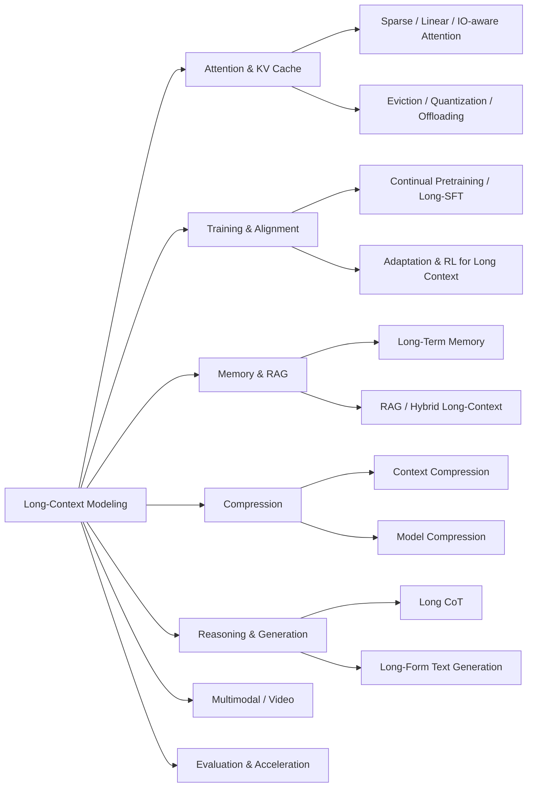

# Large Language Model Based Long Context Modeling Papers and Blogs

<!--
[](https://github.com/Xnhyacinth/Awesome-LLM-Long_Context_Modeling) [](https://opensource.org/licenses/MIT) -->
<div align="center">
 <p align="center">

<a href="https://arxiv.org/abs/2503.17407">📝 Survey Paper</a> |
<a href="#-papers">📄 Paper List</a> |
<a href="https://xnhyacinth.github.io/projects/Awesome-LCLM/">🏠 Homepage</a> |
<a href="https://www.notion.so/Huanxuan-Liao-s-Blog-6518cf95f0d54858829b042588ff88bb">📚 Notes</a> |
<a href="https://github.com/Xnhyacinth/Awesome-LLM-Long-Context-Modeling">⭐ GitHub</a>

 </p>
</div>
<div align="center">

[](https://awesome.re)
[](https://github.com/Xnhyacinth/Awesome-LLM-Long-Context-Modeling/blob/main/LICENSE)
[](https://github.com/Xnhyacinth/Awesome-LLM-Long-Context-Modeling/commits/main)
[](https://github.com/Xnhyacinth/Awesome-LLM-Long-Context-Modeling/stargazers)
[](https://github.com/Xnhyacinth/Awesome-LLM-Long-Context-Modeling/forks)
[](https://github.com/Xnhyacinth/Awesome-LLM-Long-Context-Modeling/graphs/contributors)
[](https://github.com/Xnhyacinth/Awesome-LLM-Long-Context-Modeling)
[](https://github.com/Xnhyacinth/Awesome-LLM-Long-Context-Modeling/pulls)
[](https://arxiv.org/abs/2503.17407)

</div>

This repository curates papers and blogs on long-context language modeling, covering surveys; efficient attention; KV-cache optimization; recurrent transformers and state-space models; position encoding & length extrapolation; long-context training; long-term memory; retrieval-augmented generation; in-context learning; context and model compression; long reasoning (long CoT); long video & image; long-horizon agents; long-text generation; inference acceleration; benchmarks & evaluation; and technical reports.

🔥 Must-read papers for LLM-based Long Context Modeling.

🔥⚡🔥 Thanks for all the great contributors on GitHub!

🚀🤝🚀 I have the privilege of joining [**LCLM-Horizon**] and collaborating with them on providing a very complete and comprehensive scholarly survey \([A Comprehensive Survey on Long Context Language Modeling](https://arxiv.org/abs/2503.17407)\) and repository \([A-Comprehensive-Survey-For-Long-Context-Language-Modeling](https://github.com/LCLM-Horizon/A-Comprehensive-Survey-For-Long-Context-Language-Modeling)\) dedicated to **Long Context Language Modeling**. I look forward to collaborating with them to advance research and deepen understanding in this area!

<!--Thanks to [**LCLM-Horizon**]\([A-Comprehensive-Survey-For-Long-Context-Language-Modeling](https://github.com/LCLM-Horizon/A-Comprehensive-Survey-For-Long-Context-Language-Modeling)\) for providing a very complete and comprehensive scholarly survey \([A Comprehensive Survey on Long Context Language Modeling]()\) of the field of Long Context Language Modeling. I have joined them and we will collaborate to further research and understanding in this area!-->

<details>
<summary><b>Taxonomy at a glance</b></summary>



</details>

If you find our repository and survey useful for your research, please consider citing the following paper:

```bibtex
@article{liu2025comprehensive,
  title={A Comprehensive Survey on Long Context Language Modeling},
  author={Liu, Jiaheng and Zhu, Dawei and Bai, Zhiqi and He, Yancheng and Liao, Huanxuan and Que, Haoran and Wang, Zekun and Zhang, Chenchen and Zhang, Ge and Zhang, Jiebin and others},
  journal={arXiv preprint arXiv:2503.17407},
  year={2025}
}
```

## Contents

- [📢 News](#-news)
  - [Week Papers](#week-papers)
  - [Month Papers](#month-papers)
- [📜 Papers](#-papers)
  - [1. Survey Papers](papers/01-survey.md)
  - [2. Efficient Attention](papers/02-efficient-attention.md)
  - [3. KV-Cache Optimization](papers/03-kv-cache.md)
  - [4. Recurrent Transformers](papers/04-recurrent-transformers.md)
  - [5. State Space Models & Hybrids](papers/05-state-space-models.md)
  - [6. Position Encoding & Length Extrapolation](papers/06-position-encoding.md)
  - [7. Long-Context Training](papers/07-long-context-training.md)
  - [8. Long-Term Memory](papers/08-long-term-memory.md)
  - [9. Retrieval-Augmented Generation](papers/09-retrieval-augmented-generation.md)
  - [10. In-Context Learning (Many-shot / Long-ICL)](papers/10-in-context-learning.md)
  - [11. Context Compression](papers/11-context-compression.md)
  - [12. Model Compression for Long Context](papers/12-model-compression.md)
  - [13. Long Reasoning (Long CoT)](papers/13-long-reasoning.md)
  - [14. Long Video & Image](papers/14-long-video-image.md)
  - [15. Long-Horizon Agents](papers/15-long-horizon-agents.md)
  - [16. Long-form Text Generation](papers/16-long-form-text-generation.md)
  - [17. Inference Acceleration & Serving](papers/17-inference-acceleration.md)
  - [18. Benchmarks & Evaluation](papers/18-benchmarks.md)
  - [19. Technical Reports (Long-Context Models)](papers/19-technical-reports.md)
  - [20. Blogs & Tutorials](papers/20-blogs.md)
- [Acknowledgements](#acknowledgements)
  - [Contributors](#contributors)
  - [Star History](#star-history)

## 📢 News

### Week Papers

- **[2026.07.24]**
  - Paper: [HiKV: Hierarchical Importance-Aware KV Cache with Hardware Acceleration for LLM Decoding](https://arxiv.org/abs/2607.22389)
  - Paper: [RIS-Kernel: A Model-Agnostic Architecture for Long-Context LLM Inference via Sparse Attention](https://arxiv.org/abs/2607.21927)

- **[2026.07.23]**
  - Paper: [Parameter-free Adaptive Sparse Attention via Compression-Based Content Selection](https://arxiv.org/abs/2607.21752)
  - Paper: [Learning What Matters: Supervising Sparse Attention Routing with Causal Evidence Sets](https://arxiv.org/abs/2607.21692)
  - Paper: [AttriMem: Attribution-Guided Process Feedback for Agent Memory Learning](https://arxiv.org/abs/2607.21106)
  - Paper: [Streaming Multi-Agent Autoregressive Diffusion Model with World State Registers](https://arxiv.org/abs/2607.21594)
  - Paper: [Closing the Loop: Training-Free Revisit Consistency for Autoregressive Generative Rendering](https://arxiv.org/abs/2607.21848)
  - Paper: [SANA-Video 2.0: Hybrid Linear Attention with Attention Residuals for Efficient Video Generation](https://arxiv.org/abs/2607.21553)
  - Paper: [Agentic Context Management: Solving Agent Memory and Cost by Treating Them as Lifecycle and Architecture Problems](https://arxiv.org/abs/2607.21503)
  - Paper: [MemTools: A Unified Research Framework for Interoperable Agent Memory](https://arxiv.org/abs/2607.21404)
  - Paper: [Delivery, Not Storage: Cue-Anchored Working Memory as a Harness Property for Coding Agents](https://arxiv.org/abs/2607.20972)

- **[2026.07.22]**
  - Paper: [ArbiGraph: Arbitrarily Scalable Verifiable Task Graphs for Evaluating Context Management](https://arxiv.org/abs/2607.20764) [](https://github.com/pavelgolikov/ArbiGraph)
  - Paper: [SLPO: Scaling Latent Reasoning via a Surrogate Policy](https://arxiv.org/abs/2607.19691)
  - Paper: [Self Gradient Forcing: Native Long Video Extrapolation](https://arxiv.org/abs/2607.20368)
  - Paper: [JANUS: Foreseeing Latent Risk for Long-Horizon Agent Safety](https://arxiv.org/abs/2607.19913)
  - Paper: [PRO-LONG: Programmatic Memory Enables Long-Horizon Reasoning](https://arxiv.org/abs/2607.20064) [](https://github.com/alexisfox7/PRO-LONG)

- **[2026.07.21]**
  - Paper: [ABot-World-0: Infinite Interactive World Rollout on a Single Desktop GPU](https://arxiv.org/abs/2607.19191)
  - Paper: [FilmWorld: Agentic Novel-to-Film Generation through Dynamic Cinematic World Modeling](https://arxiv.org/abs/2607.19038)

- **[2026.07.20]**
  - Paper: [C$^2$KV: Compressed and Composable KV Cache Reuse for Efficient LLM Inference](https://arxiv.org/abs/2607.17715)
  - Paper: [Is Progressive Disclosure All You Need for Long-Context Agents?](https://arxiv.org/abs/2607.17598)
  - Paper: [AlayaWorld: Interactive Long-Horizon World Modeling -- Full Technical Report](https://arxiv.org/abs/2607.18367) [](https://github.com/AlayaLab/AlayaWorld) [](https://alaya-lab.github.io/AlayaWorld/)
  - Paper: [Surprise Forcing: What to Remember, When to Skip in Long Video Generation](https://arxiv.org/abs/2607.18436)
  - Paper: [ConsiSpace: Learning Geometric Consistency Matters for Video Spatial Reasoning](https://arxiv.org/abs/2607.17599)
  - Paper: [FlashRT: Agent Harness for Guiding Agents to Deploy Real-Time Multimodal Applications](https://arxiv.org/abs/2607.18171)
  - Paper: [How Agent Skills Fail under Long Contexts: A White-Box Study in Code Auditing](https://arxiv.org/abs/2607.17937)

- **[2026.07.19]**
  - Paper: [TimeLens2: Generalist Video Temporal Grounding with Multimodal LLMs](https://arxiv.org/abs/2607.17423)
  - Paper: [EvolvingWorld: An Open-Schema Framework for Co-Evolving Role-Play Agents and World Model in Interactive Literary World](https://arxiv.org/abs/2607.17250)

- **[2026.07.18]**
  - Paper: [From Memory to Skills: Evidence-Grounded Co-Evolution Governance for Long-Horizon LLM Agents](https://arxiv.org/abs/2607.16621)

- **[2026.07.17]**
  - Paper: [SlotMem: Character-Addressable Internal Memory for Narrative Long Video Generation](https://arxiv.org/abs/2607.15772) [](https://github.com/YilaiLiu-HKU/SlotMem)
  - Paper: [FVAttn: Adaptive Sparse Attention with Runtime Load Balancing for Video Generation](https://arxiv.org/abs/2607.16190)
  - Paper: [Audio-Visual Flamingo: Open Audio-Visual Intelligence for Long and Complex Videos](https://arxiv.org/abs/2607.16107)
  - Paper: [Recursive Harness Self-Improvement](https://arxiv.org/abs/2607.15524)
  - Paper: [ToolVerse: Unlocking Massive Environments and Long-Horizon Tasks for Agentic Reinforcement Learning](https://arxiv.org/abs/2607.15660)
  - Paper: [DSWorld: A Data Science World Model for Efficient Autonomous Agents](https://arxiv.org/abs/2607.15901)

- **[2026.07.16]**
  - Paper: [VideoChat3: Fully Open Video MLLM for Efficient and Generalist Video Understanding](https://arxiv.org/abs/2607.14935)
  - Paper: [LongStraw: Long-Context RL Beyond 2M Tokens under a Fixed GPU Budget](https://arxiv.org/abs/2607.14952) [](https://github.com/MindLab-Research/longstraw)
  - Paper: [Long-Context Fine-Tuning with Limited VRAM](https://arxiv.org/abs/2607.15105)

- **[2026.07.15]**
  - Paper: [Self-Evolving Agent Harnesses via Gated Semantic Quality-Diversity](https://arxiv.org/abs/2607.13683)
  - Paper: [Smarter and Cheaper at Once: Byte-Exact KV-Cache Grafting Turns a Frozen Small Model into a Verified-Knowledge Flywheel](https://arxiv.org/abs/2607.14431)

- **[2026.07.14]**
  - Paper: [ReflectWorld-MM: An Entity-Oriented Multimodal Memory System for Open-Ended Video Streams](https://arxiv.org/abs/2607.09759)
  - Paper: [Harness Handbook: Making Evolving Agent Harnesses Readable,Navigable, and Editable](https://arxiv.org/abs/2607.13285)
  - Paper: [MemoHarness: Agent Harnesses That Learn from Experience](https://arxiv.org/abs/2607.14159)
  - Paper: [Oracle Agent Memory as an Enterprise Memory Substrate for Long-Horizon AI Agents](https://arxiv.org/abs/2607.13157)
  - Paper: [MemOps: Benchmarking Lifecycle Memory Operations in Long-Horizon Conversations](https://arxiv.org/abs/2607.12893)
  - Paper: [VisCo: Leveraging Large Language Models as Intrinsic Encoders for Visual Token Compression](https://arxiv.org/abs/2607.12756)
  - Paper: [FOLIO: Focused Semantic Memory for Streaming Video Understanding](https://arxiv.org/abs/2607.13298)

- **[2026.07.13]**
  - Paper: [Vinci2: Providing Proactive Assistance in Continuous Egocentric Videos](https://arxiv.org/abs/2607.11523)
  - Paper: [LightMem-Ego: Your AI Memory for Everyday Life](https://arxiv.org/abs/2607.11487) [](https://github.com/zjunlp/LightMem-Ego)
  - Paper: [ToFu: A White-Box, Token-Efficient Agent Harness for Researchers](https://arxiv.org/abs/2607.11423)
  - Paper: [StructAgent: Harness Long-horizon Digital Agents with Unified Causal Structure](https://arxiv.org/abs/2607.11388)
  - Paper: [SLVMBench: Skill Learning from Video Memory](https://arxiv.org/abs/2607.11312)

### Month Papers

<details><summary>Month Papers</summary>

- **[2026.07.12]**
  - Paper: [MemDecay: Region-Aware KV Cache Eviction for Efficient LLM Agent Inference](https://arxiv.org/abs/2607.10582)

- **[2026.07.11]**
  - Paper: [SynthDocBench: Controlled Benchmark for Long-Context Visual Document Understanding](https://arxiv.org/abs/2607.10400)

- **[2026.07.10]**
  - Paper: [Scoped Verification for Reliable Long-Horizon Agentic Context Evolution under Distribution Shift](https://arxiv.org/abs/2607.09175)
  - Paper: [COBS: Cumulant Order Block Sparse Attention](https://arxiv.org/abs/2607.09052)
  - Paper: [Self-Guided Test-Time Training for Long-Context LLMs](https://arxiv.org/abs/2607.09415)

- **[2026.07.09]**
  - Paper: [OPSD-V: On-Policy Self-Distillation for Post-Training Few-Step Autoregressive Video Generators](https://arxiv.org/abs/2607.08766)
  - Paper: [Long-Horizon-Terminal-Bench: Testing the Limits of Agents on Long-Horizon Terminal Tasks with Dense Reward-Based Grading](https://arxiv.org/abs/2607.08964)
  - Paper: [What to Keep, What to Forget: A Rate--Distortion View of Memory Compaction in LLMs and Agents](https://arxiv.org/abs/2607.08032)
  - Paper: [Remember When It Matters: Proactive Memory Agent for Long-Horizon Agents](https://arxiv.org/abs/2607.08716) [](https://github.com/loversky02/promem-vn)

- **[2026.07.08]**
  - Paper: [Infinite Worlds with Versatile Interactions](https://arxiv.org/abs/2607.07534)
  - Paper: [The Harness Effect: How Orchestration Design Sets the Token Economics of Enterprise Agentic AI](https://arxiv.org/abs/2607.06906)
  - Paper: [Jet-Long: Efficient Long-Context Extension with Dynamic Bifocal RoPE](https://arxiv.org/abs/2607.07740)
  - Paper: [Linear Attention Architectures: Mechanisms, Trade-offs, and Cross-Layer Routing](https://arxiv.org/abs/2607.07953) [](https://github.com/tommasocerruti/linear-attention-architectures)
  - Paper: [Sparse Delta Memory: Scaling the State of Linear RNNs through Sparsity](https://arxiv.org/abs/2607.07386)
  - Paper: [AnchorPrune: Relevance-Anchored Contextual Expansion for Visual Token Pruning](https://arxiv.org/abs/2607.07033)

- **[2026.07.07]**
  - Paper: [AlayaWorld: Long-Horizon and Playable Video World Generation](https://arxiv.org/abs/2607.06291) [](https://github.com/AlayaLab/AlayaWorld) [](https://alaya-lab.github.io/AlayaWorld/)
  - Paper: [Imagined Rollouts are Kinematic, Not Dynamic: A Diagnosis of Long-Horizon World-Model Failure](https://arxiv.org/abs/2607.05966)
  - Paper: [TurnOPD: Making On-Policy Distillation Turn-Aware for Efficient Long-Horizon Agent Training](https://arxiv.org/abs/2607.05804)
  - Paper: [DepthWeave-KV: Token-Adaptive Cross-Layer Residual Factorization for Long-Context KV Cache Compression](https://arxiv.org/abs/2607.06523)
  - Paper: [FreqDepthKV: Frequency-Guided Depth Sharing for Robust KV Cache Compression in Long-Context LLM Inference](https://arxiv.org/abs/2607.06519)

- **[2026.07.06]**
  - Paper: [Multiplayer Interactive World Models with Representation Autoencoders](https://arxiv.org/abs/2607.05352)
  - Paper: [Do All Visual Tokens Matter Equally? Object-Evidence Preserving Token Merging for Vision-Language Retrieval](https://arxiv.org/abs/2607.04605)
  - Paper: [CompactionRL: Reinforcement Learning with Context Compaction for Long-Horizon Agents](https://arxiv.org/abs/2607.05378)
  - Paper: [KVpop -- Key-Value Cache Compression with Predictive Online Pruning](https://arxiv.org/abs/2607.05061)
  - Paper: [Light-Omni: Reflex over Reasoning in Agentic Video Understanding with Long-Term Memory](https://arxiv.org/abs/2607.05511)

- **[2026.07.04]**
  - Paper: [SelfMem: Self-Optimizing Memory for AI Agents](https://arxiv.org/abs/2607.03726)

- **[2026.07.03]**
  - Paper: [HyperVAttention: Efficient Sparse Attention with Spatio-Temporal Clustering for Video Diffusion](https://arxiv.org/abs/2607.03012)
  - Paper: [GuideMe: Multi-Domain Task Guidance and Intervention in Streaming Video](https://arxiv.org/abs/2607.02991)
  - Paper: [Hierarchical Sparse Attention Done Right: Toward Infinite Context Modeling](https://arxiv.org/abs/2607.02980)

- **[2026.07.02]**
  - Paper: [AgenticSTS: A Bounded-Memory Testbed for Long-Horizon LLM Agents](https://arxiv.org/abs/2607.02255)
  - Paper: [A Hippocampus for Linear Attention: An Exact Memory for What the Recurrent State Forgets](https://arxiv.org/abs/2607.02303)
  - Paper: [LASER: A Corrective Lens for LVLMs via Visual Attention Preservation and Sink Suppression](https://arxiv.org/abs/2607.01707)

- **[2026.07.01]**
  - Paper: [MemSyco-Bench: Benchmarking Sycophancy in Agent Memory](https://arxiv.org/abs/2607.01071) [](https://github.com/XMUDeepLIT/MemSyco-Bench)
  - Paper: [MosaicKV: Serving Long-Context LLM with Dynamic Two-D KV Cache Compression](https://arxiv.org/abs/2607.00760)
  - Paper: [Imprint: Online Memory Compression for Long-Horizon Egocentric QA](https://arxiv.org/abs/2607.00696)
  - Paper: [Self-GC: Self-Governing Context for Long-Horizon LLM Agents](https://arxiv.org/abs/2607.00692)

- **[2026.06.30]**
  - Paper: [ECHO: Prune To Act, Trace To Learn With Selective Turn Memory In Agentic RL](https://arxiv.org/abs/2606.31650)
  - Paper: [RaBitQCache: Rotated Binary Quantization for KVCache in Long Context LLM Inference](https://arxiv.org/abs/2606.31519) [](https://github.com/Sakuraaa0/RaBitQCache)
  - Paper: [SeKV: Resolution-Adaptive KV Cache with Hierarchical Semantic Memory for Long-Context LLM Inference](https://arxiv.org/abs/2606.31145) [](https://github.com/AmirAbaskohi/SeKV)
  - Paper: [CoLT: Teaching Multi-Modal Models to Think with Chain of Latent Thoughts](https://arxiv.org/abs/2606.31986) [](https://github.com/hulianyuyy/CoLT)
  - Paper: [MemLearner: Learning to Query Context memory for Video World Models](https://arxiv.org/abs/2606.31734) [](https://github.com/yujiwen/memlearner)

- **[2026.06.29]**
  - Paper: [SWE-INTERACT: Reimagining SWE Benchmarks as User-Driven Long-Horizon Coding Sessions](https://arxiv.org/abs/2606.30573)
  - Paper: [Diagnosing and Mitigating Context Rot in Long-horizon Search](https://arxiv.org/abs/2606.29718)
  - Paper: [Predict, Reuse, and Repair: Accelerating Dynamic Sparse Attention for Long-Context LLM Decoding](https://arxiv.org/abs/2606.30389) [](https://github.com/Tianyu9748/Incremental_FlashAttention)
  - Paper: [Morphing into Hybrid Attention Models](https://arxiv.org/abs/2606.30562)
  - Paper: [LLM Agents Are Latent Context Managers: Eliciting Self-Managed Context via a Proprioceptive Dashboard](https://arxiv.org/abs/2606.30005)

- **[2026.06.28]**
  - Paper: [OSWorld2.0: Benchmarking Computer Use Agents on Long-Horizon Real-World Tasks](https://arxiv.org/abs/2606.29537)

- **[2026.06.26]**
  - Paper: [Reflect-R1: Evidence-Driven Reflection for Self-Correction in Long Video Understanding](https://arxiv.org/abs/2606.27922)

- **[2026.06.25]**
  - Paper: [DMV-Bench: Diagnosing Long-Horizon Multimodal Agents' Visual Memory with Incidental Cue Injection](https://arxiv.org/abs/2606.27499) [](https://github.com/yyyujintang/DMV-Bench)
  - Paper: [Information-Aware KV Cache Compression for Long Reasoning](https://arxiv.org/abs/2606.26875)
  - Paper: [ProtoKV: Streaming Video Understanding under Delayed Query with Summary-State Memory](https://arxiv.org/abs/2606.26762)
  - Paper: [Erase-then-Delta Attention: Decoupling Erase and Write Addresses in Delta-Rule Linear Attention](https://arxiv.org/abs/2606.26560)

- **[2026.06.24]**
  - Paper: [Towards a Dynamic and Fixed-budget Memory Bank for Efficient Streaming Video Understanding](https://arxiv.org/abs/2606.25658) [](https://github.com/hktk07/CausalMem)

- **[2026.06.23]**
  - Paper: [Qwen-AgentWorld: Language World Models for General Agents](https://arxiv.org/abs/2606.24597) [](https://github.com/QwenLM/Qwen-AgentWorld)
  - Paper: [ATMA: Length-Invariant Language Modeling via Polar Attention and Gated-Delta Compression Memory](https://arxiv.org/abs/2606.25156) [](https://github.com/kreasof-ai/atma)
  - Paper: [RoPE-Aware Bit Allocation for KV-Cache Quantization](https://arxiv.org/abs/2606.24033) [](https://github.com/JIA-Lab-research/blockgtq)

- **[2026.06.22]**
  - Paper: [ScalingAttention: Discovering Intrinsic Sparse Attention Topology for Video Diffusion Transformers](https://arxiv.org/abs/2606.23019)
  - Paper: [DynamicMem: A Long-Horizon Memory Benchmark in Real-World Settings](https://arxiv.org/abs/2606.22877) [](https://wenyaxie023.github.io/DynamicMem/)
  - Paper: [Tapered Language Models](https://arxiv.org/abs/2606.23670)

- **[2026.06.20]**
  - Paper: [Keyless Attention: Value-Space Routing and Value-Only Caching for Efficient Transformers](https://arxiv.org/abs/2606.21848)

- **[2026.06.19]**
  - Paper: [EvoEmbedding: Evolvable Representations for Long-Context Retrieval and Agentic Memory](https://arxiv.org/abs/2606.21649)

- **[2026.06.18]**
  - Paper: [Connect the Dots: Training LLMs for Long-Lifecycle Agents with Cross-Domain Generalization Via Reinforcement Learning](https://arxiv.org/abs/2606.20002) [](https://github.com/agentscope-ai/Trinity-RFT/tree/research/cod/examples/research_cod)
  - Paper: [ADaPT: Token-Level Decoupling for Efficient Large Reasoning Models](https://arxiv.org/abs/2606.19919)
  - Paper: [CARE: Competence-Aware Reward Shaping for Adaptive Reasoning Length in Video-MLLMs](https://arxiv.org/abs/2606.19927) [](https://github.com/1Pansy/Video-CARE)
  - Paper: [HydraHead: From Head-Level Functional Heterogeneity to Specialized Attention Hybridization](https://arxiv.org/abs/2606.20097)

- **[2026.06.17]**
  - Paper: [GateMem: Benchmarking Memory Governance in Multi-Principal Shared-Memory Agents](https://arxiv.org/abs/2606.18829) [](https://github.com/rzhub/GateMem)
  - Paper: [Beyond Reward Engineering: A Data Recipe for Long-Context Reinforcement Learning](https://arxiv.org/abs/2606.18831)

- **[2026.06.16]**
  - Paper: [LLMZero: Discovering Adaptive Training Strategies for RL Post-Training via LLM Agents](https://arxiv.org/abs/2606.18388)
  - Paper: [Looped World Models](https://arxiv.org/abs/2606.18208)
  - Paper: [LiveStarPro: Proactive Streaming Video Understanding with Hierarchical Memory for Long-Horizon Streams](https://arxiv.org/abs/2606.17798)

- **[2026.06.15]**
  - Paper: [TokenPilot: Cache-Efficient Context Management for LLM Agents](https://arxiv.org/abs/2606.17016)
  - Paper: [Taylor-Calibrate: Principled Initialization for Hybrid Linear Attention Distillation](https://arxiv.org/abs/2606.16429)
  - Paper: [Long-Context Modeling via GSS-Transformer Hybrid Architecture with Learnable Mixing](https://arxiv.org/abs/2606.16093)
  - Paper: [Tangram: Unlocking Non-Uniform KV Cache Compression for Efficient Multi-turn LLM Serving](https://arxiv.org/abs/2606.06302)

- **[2026.06.14]**
  - Paper: [LLM-as-Code: Agentic Programming for Agent Harness](https://arxiv.org/abs/2606.15874)

- **[2026.06.12]**
  - Paper: [HarnessX: A Composable, Adaptive, and Evolvable Agent Harness Foundry](https://arxiv.org/abs/2606.14249)
  - Paper: [StreamMemBench: Streaming Evaluation of Agent Memory for Future-Oriented Assistance](https://arxiv.org/abs/2606.14571) [](https://github.com/landian60/StreamMemBench)

- **[2026.06.11]**
  - Paper: [EvoArena: Tracking Memory Evolution for Robust LLM Agents in Dynamic Environments](https://arxiv.org/abs/2606.13681)
  - Paper: [MiniMax Sparse Attention](https://arxiv.org/abs/2606.13392) [](https://github.com/MiniMax-AI/MSA)
  - Paper: [Learning What to Remember: A Cognitively Grounded Multi-Factor Value Model for Agentic Memory](https://arxiv.org/abs/2606.12945)
  - Paper: [Can I Buy Your KV Cache?](https://arxiv.org/abs/2606.13361)
  - Paper: [Demystifying Hidden-State Recurrence: Switchable Latent Reasoning with On-Policy Reinforcement Learning](https://arxiv.org/abs/2606.13106)

- **[2026.06.10]**
  - Paper: [On Subquadratic Architectures: From Applications to Principles](https://arxiv.org/abs/2606.12364)
  - Paper: [Adaptive Multi-Resolution Procedural Knowledge Compression for Large Language Models](https://arxiv.org/abs/2606.12203)

- **[2026.06.09]**
  - Paper: [Parallel Causal Associative Fields: Gated Sparse Memory for Long-Context Language Modeling](https://arxiv.org/abs/2606.10435) [](https://github.com/ahmed123hds/PCAF)
  - Paper: [Attention Amnesia in Hybrid LLMs: When CoT Fine-Tuning Breaks Long-Range Recall, and How to Fix It](https://arxiv.org/abs/2606.11052)
  - Paper: [Dynamic Linear Attention](https://arxiv.org/abs/2606.10650)

- **[2026.06.08]**
  - Paper: [IS-CoT: Breaking the Long-form Generation Collapse via Interleaved Structural Thinking](https://arxiv.org/abs/2606.09709)
  - Paper: [Memory Beyond Recall: A Dual-Process Cognitive Memory System for Self-Evolving LLM Agents](https://arxiv.org/abs/2606.09483)
  - Paper: [H2HMem: A Multimodal Memory Benchmark for Agents in Human-Human Interactions](https://arxiv.org/abs/2606.09461)
  - Paper: [FlashMemory-DeepSeek-V4: Lightning Index Ultra-Long Context via Lookahead Sparse Attention](https://arxiv.org/abs/2606.09079) [](https://github.com/libertywing/FlashMemory-Deepseek-V4)
  - Paper: [End-to-End Context Compression at Scale](https://arxiv.org/abs/2606.09659)

- **[2026.06.07]**
  - Paper: [Sparrow: Sparse Rollout for Stable and Efficient Long-context RL of Large Language Models](https://arxiv.org/abs/2606.08446)
  - Paper: [Look Less, Reason More: Block-wise Attention Skipping for Efficient Multimodal LLMs](https://arxiv.org/abs/2606.08511)
  - Paper: [From Player to Master: Enhancing Test-Time Learning of LLM Agents via Reinforcement Learning over Memory](https://arxiv.org/abs/2606.08656) (ICML 2026)

- **[2026.06.06]**
  - Paper: [IntentKV: Cross-Turn Intent-Aware KV Cache Pruning for Agent Inference](https://arxiv.org/abs/2606.09916)

- **[2026.06.05]**
  - Paper: [How Much Dense Attention is Necessary? Oracle-Guided Sparse Prefill for Full/GQA Layers in Hybrid Long-Context Models](https://arxiv.org/abs/2606.07703)
  - Paper: [Rosetta Memory: Adaptive Memory for Cross-LLM Agents](https://arxiv.org/abs/2606.07711)
  - Paper: [SWE-Marathon: Can Agents Autonomously Complete Ultra-Long-Horizon Software Work?](https://arxiv.org/abs/2606.07682) [](https://swe-marathon.org/)

- **[2026.06.04]**
  - Paper: [RedKnot: Efficient Long-Context LLM Serving with Head-Aware KV Reuse and SegPagedAttention](https://arxiv.org/abs/2606.06256)
  - Paper: [TARPO: Token-Wise Latent-Explicit Reasoning via Action-Routing Policy Optimization](https://arxiv.org/abs/2606.05859) [](https://github.com/NKU-LITI/TARPO-master)
  - Paper: [You Only Index Once: Cross-Layer Sparse Attention with Shared Routing](https://arxiv.org/abs/2606.06467)

- **[2026.06.03]**
  - Paper: [Cartridges at Scale: Training Modular KV Caches over Large Document Collections](https://arxiv.org/abs/2606.04557)
  - Paper: [LazyAttention: Efficient Retrieval-Augmented Generation with Deferred Positional Encoding](https://arxiv.org/abs/2606.04302) (ICML 2026)
  - Paper: [SparDA: Sparse Decoupled Attention for Efficient Long-Context LLM Inference](https://arxiv.org/abs/2606.04511) [](https://github.com/NVlabs/SparDA)
  - Paper: [Depth-Attention: Cross-Layer Value Mixing for Language Models](https://arxiv.org/abs/2606.05014)
  - Paper: [Video2LoRA: Parametric Video Internalization for Vision-Language Models](https://arxiv.org/abs/2606.04351)
  - Paper: [Plan, Watch, Recover: A Benchmark and Architectures for Proactive Procedural Assistance](https://arxiv.org/abs/2606.04970)
  - Paper: [Rethinking Continual Experience Internalization for Self-Evolving LLM Agents](https://arxiv.org/abs/2606.04703)
  - Paper: [Learning While Acting: A Skill-Enhanced Test-Time Co-Evolution Framework for Online Lifelong Learning Agents](https://arxiv.org/abs/2606.04815)

- **[2026.06.02]**
  - Paper: [HybridThinker: Efficient Chain-of-Thought Reasoning via Compressed Memory and Transient Thought Steps](https://arxiv.org/abs/2606.03768)
  - Paper: [MemTrain: Self-Supervised Context Memory Training](https://arxiv.org/abs/2606.03197)
  - Paper: [KVarN: Variance-Normalized KV-Cache Quantization Mitigates Error Accumulation in Reasoning Tasks](https://arxiv.org/abs/2606.03458) [](https://github.com/huawei-csl/KVarN)
  - Paper: [Value-Aware Stochastic KV Cache Eviction for Reasoning Models](https://arxiv.org/abs/2606.03928) [](https://github.com/terarachang/VaSE)

- **[2026.06.01]**
  - Paper: [RESTORE: Improving Visual Token Reduction via Rectifying Distortions for Efficient Multimodal LLM Inference](https://arxiv.org/abs/2606.01711) (ICML 2026)
  - Paper: [PaSBench-Video: A Streaming Video Benchmark for Proactive Safety Warning](https://arxiv.org/abs/2606.02443)
  - Paper: [LayerRoute: Input-Conditioned Adaptive Layer Skipping via LoRA Fine-Tuning for Agentic Language Models](https://arxiv.org/abs/2606.01838)
  - Paper: [Attention-guided Fine-tuning of Multimodal Large Language Models Improves Chain-of-Thought Reasoning](https://arxiv.org/abs/2606.01558)
  - Paper: [Do Transformers Need Three Projections? Systematic Study of QKV Variants](https://arxiv.org/abs/2606.04032) [](https://github.com/Brainchip-Inc/Do-Transformers-Need-3-Projections)

 </details>

## 📜 Papers

Paper entries live under [`papers/`](papers/) so this README stays under GitHub's homepage size limit.
For an interactive chapter reader (search + in-page paper cards), open the
[project homepage](https://xnhyacinth.github.io/projects/Awesome-LCLM/).

<details open>
<summary><b>Attention, recurrence &amp; systems</b></summary>

- [1. Survey Papers](papers/01-survey.md)
- [2. Efficient Attention](papers/02-efficient-attention.md)
- [3. KV-Cache Optimization](papers/03-kv-cache.md)
- [4. Recurrent Transformers](papers/04-recurrent-transformers.md)
- [5. State Space Models &amp; Hybrids](papers/05-state-space-models.md)
- [17. Inference Acceleration &amp; Serving](papers/17-inference-acceleration.md)

</details>

<details open>
<summary><b>Training, position &amp; memory</b></summary>

- [6. Position Encoding &amp; Length Extrapolation](papers/06-position-encoding.md)
- [7. Long-Context Training](papers/07-long-context-training.md)
- [8. Long-Term Memory](papers/08-long-term-memory.md)
- [9. Retrieval-Augmented Generation](papers/09-retrieval-augmented-generation.md)
- [10. In-Context Learning (Many-shot / Long-ICL)](papers/10-in-context-learning.md)

</details>

<details open>
<summary><b>Compression, reasoning &amp; multimodal</b></summary>

- [11. Context Compression](papers/11-context-compression.md)
- [12. Model Compression for Long Context](papers/12-model-compression.md)
- [13. Long Reasoning (Long CoT)](papers/13-long-reasoning.md)
- [14. Long Video &amp; Image](papers/14-long-video-image.md)
- [15. Long-Horizon Agents](papers/15-long-horizon-agents.md)
- [16. Long-form Text Generation](papers/16-long-form-text-generation.md)

</details>

<details open>
<summary><b>Evaluation &amp; reports</b></summary>

- [18. Benchmarks &amp; Evaluation](papers/18-benchmarks.md)
- [19. Technical Reports (Long-Context Models)](papers/19-technical-reports.md)
- [20. Blogs &amp; Tutorials](papers/20-blogs.md)

</details>

## Acknowledgements

Please contact me if I miss your names in the list, I will add you back ASAP!

### Contributors

<a href="https://github.com/Xnhyacinth/Awesome-LLM-Long-Context-Modeling/graphs/contributors">
  
</a>

### Star History

[](https://github.com/Xnhyacinth/Awesome-LLM-Long-Context-Modeling/stargazers)
